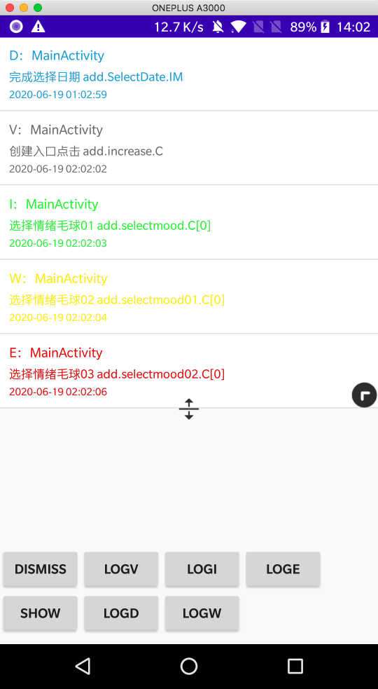
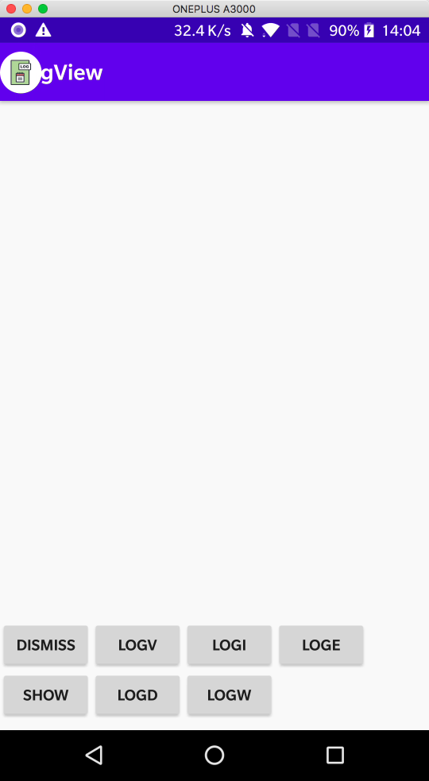

# 一个应用内的LogView

|            展开            |           收起            |
| :------------------------: | :-----------------------: |
|  |  |


## 依赖

```groovy
debugImplementation 'me.simple:logview:1.0.2'
releaseImplementation 'me.simple:logview-no-op:1.0.2'
```

## 使用

```kotlin
class DemoApp : Application() {

    override fun onCreate() {
        super.onCreate()
        LogView.init(this)
    }
}
//在合适位置调用
LogView.show()
//日志输出
LogView.v(tag, msg)
LogView.d(tag, msg)
LogView.i(tag, msg)
LogView.w(tag, msg)
LogView.e(tag, msg)
//在合适位置调用
LogView.dismiss()
```

## 版本迭代

* v1.0.2：重命名资源文件，增加`showByHasPermissions()`方法
* v1.0.1：删除`logview-base`
* v1.0.0：首次上传